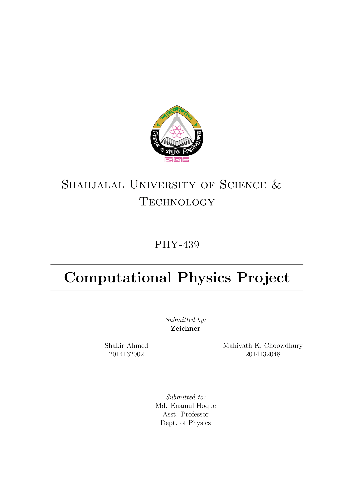
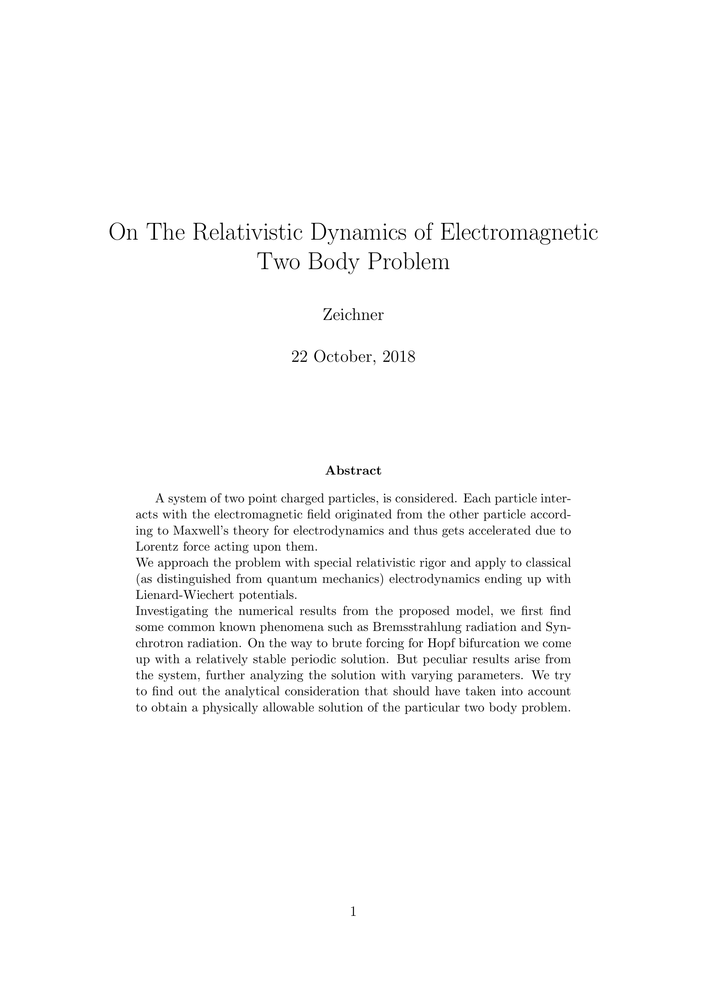

# On The Relativistic Dynamics of Electromagnetic Two Body Problem

This work was submitted by the team "Zeichner" for the required project of Computational Physics-I (PHY439)

#  Absttract

A system of two point charged particles, is considered. Each particle inter- acts with the electromagnetic field originated from the other particle accord- ing to Maxwell’s theory for electrodynamics and thus gets accelerated due to Lorentz force acting upon them.
We approach the problem with special relativistic rigor and apply to classical (as distinguished from quantum mechanics) electrodynamics ending up with Lienard-Wiechert potentials.
Investigating the numerical results from the proposed model, we first find some common known phenomena such as Bremsstrahlung radiation and Syn- chrotron radiation. On the way to brute forcing for Hopf bifurcation we come up with a relatively stable periodic solution. But peculiar results arise from the system, further analyzing the solution with varying parameters. We try to find out the analytical consideration that should have taken into account to obtain a physically allowable solution of the particular two body problem.

All the codes are written by **Shakir Ahmed**
(s.ahmed7733@gmail.com)
(shakir.ahmed@student.sust.edu)

(c) s.ahmed7733@gmail.com
(c) mahiyath.hiya.18@gmail.com